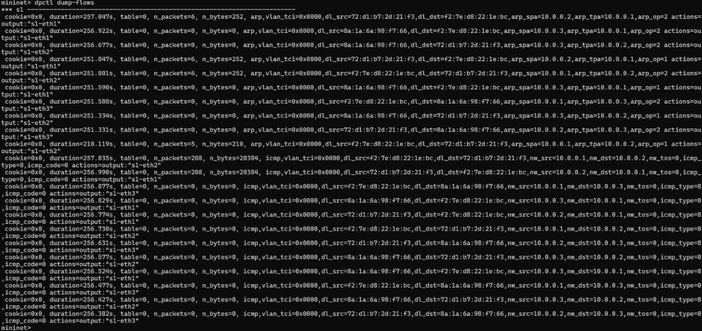
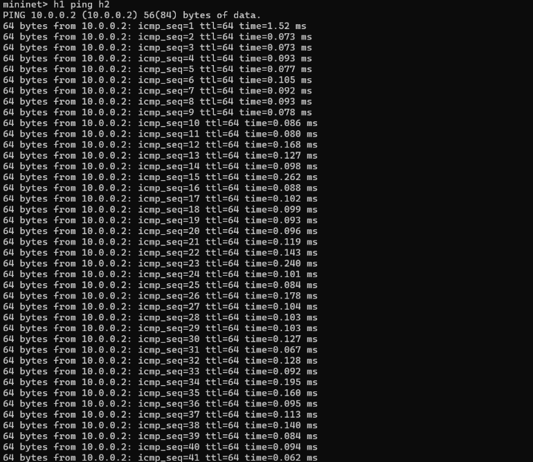
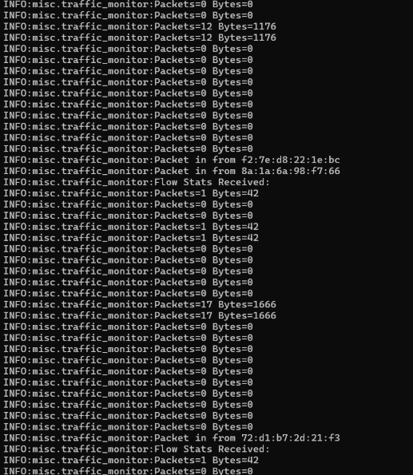

# SDN Traffic Monitoring using POX and Mininet

## 📌 Problem Statement

This project implements a Software Defined Networking (SDN) based traffic monitoring system using the POX controller and Mininet.
The goal is to demonstrate controller-switch interaction, OpenFlow-based flow rule design (match–action), and real-time network behavior monitoring.

---

## 🎯 Objectives

* Demonstrate SDN architecture using controller and switches
* Implement OpenFlow-based communication
* Handle `packet_in` events in the controller
* Monitor real-time traffic statistics (packets and bytes)
* Validate network behavior using test scenarios

---

## 🛠 Tech Stack

| Tool           | Role                            |
| -------------- | ------------------------------- |
| Mininet        | Network emulator                |
| POX Controller | SDN controller                  |
| OpenFlow       | Controller-switch communication |
| Python         | Controller logic implementation |

---

## ⚙️ Setup Instructions

### Prerequisites

* Linux (Ubuntu recommended)
* Mininet installed
* POX controller cloned

---

### 1. Start the POX Controller

```bash
python3 pox.py misc.traffic_monitor
```

---

### 2. Start Mininet Topology

In a new terminal:

```bash
sudo mn --topo single,3 --controller remote
```

---

## 🚀 Running the Experiment

Inside Mininet CLI:

```bash
# Test connectivity
pingall

# Generate traffic
h1 ping h2
```

---

## ⚡ Controller Functionality

* Handles `packet_in` events from switches
* Installs flow rules using OpenFlow
* Collects flow statistics periodically:

  * Packet count
  * Byte count

---

## 🔁 Flow Rule Logic (Match–Action)

The controller dynamically installs flow rules based on incoming packets.

**Example Flow Rule:**

* Match: Source = h1, Destination = h2
* Action: Forward packet to the destination port

These rules are installed when a `packet_in` event is triggered by the switch.

---

## 🧪 Test Scenarios

### ✅ Test Case 1 — Normal Traffic

* Hosts communicate successfully (h1 → h2)
* No packet loss observed
* Ping results confirm connectivity

---

### ✅ Test Case 2 — Traffic Monitoring

* Controller receives flow statistics
* Packet and byte count increase with traffic
* Logs are displayed in controller terminal

---

### ⚠️ Test Case 3 — No Traffic Scenario

* When no traffic is generated, no flow statistics are observed
* Demonstrates dependency on active traffic for monitoring

---

## 📊 Expected Output

* Successful ping between hosts
* Flow rules installed in switches
* Controller logs showing:

  * packet_in events
  * flow statistics (packets & bytes)

Example:

```
[INFO] Flow stats received from switch
Packets=27  Bytes=2646
Packets=22  Bytes=2156
```

---

## 📸 Proof of Execution

### Flow Table



### Ping Results



### Controller Logs



---

## 🧠 Key Concepts Demonstrated

* SDN architecture (control plane vs data plane)
* Controller-switch interaction
* OpenFlow protocol usage
* Flow rule design (match → action)
* Handling packet_in events
* Real-time traffic monitoring

---

## 🔍 Validation

* Connectivity validated using `pingall`
* Traffic behavior observed via controller logs
* Flow statistics confirm correct monitoring
* Traffic can be further analyzed using tools like Wireshark or iperf

---

## 📁 Project Structure

```
.
├── pox/
│   └── misc/
│       └── traffic_monitor.py   # Custom POX controller logic
├── screenshots/                # Execution proof images
└── README.md
```

---

## 📚 References

* POX Documentation
* Mininet Walkthrough
* OpenFlow Specification

---

## ✅ Conclusion

This project successfully demonstrates how SDN enables centralized control and monitoring of network traffic using Mininet and POX. It highlights the use of OpenFlow for dynamic flow management and real-time network visibility.

---
